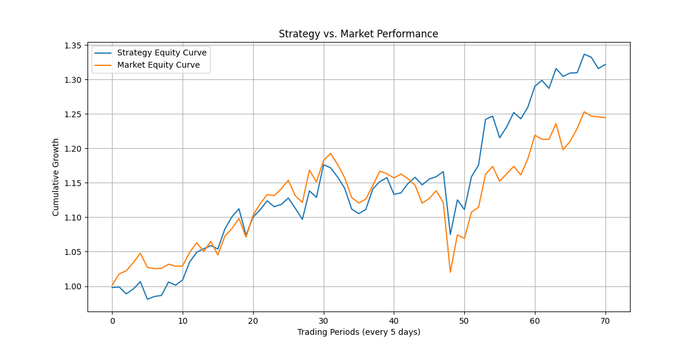

# Quantitative Trading Strategy using Bidirectional LSTM

# Overview

This project aims to predict a short term (5-day) risk-adjusted returns (Sharpe Ratio) for SP500 companies using a deep learning model (LSTM). The goal was to identify stocks to outperform the overall market in the next 5 days , forming the basis of a quantitative swing trading strategy. 

## Data & Features 

- The primary data was extracted through the yfinance package which was used to extract SP500 individual stock and overall market OHLCV data from 2015- present 

- The LSTM model is trained to predict the future 5-day Sharpe ratio and the XGBoostRanker was used to rank the stocks for the next 5 days 

### Feature Engineering
The model utilizes a sequence of the following features over a **30-day lookback window** (`SEQUENCE_LENGTH=30`):

- **Time-Based:**
    - `month_sin`, `month_cos` (Cyclical encoding of the month)
- **Core Technicals:**
    - `return_5d` (Past 5-day return)
    - `rsi_14d`
    - `volatility_10d`, `volatility_20d`
    - `stochastic_k`, `stochastic_d`
    - `ema_8_21_cross` (Binary signal)
    - `ema_21d`, `ema_8d` (Exponential Moving Averages)
    - `macd_histogram`
    - `obv_scaled` (On-Balance Volume)
    - `atr_14d` (Average True Range)
    - `bollinger_percent_b`
    - `roc_21d` (Rate of Change)
- **Market Context:**
    - `sp500_return_5d` (Past 5-day S&P 500 return)
    - `relative_strength_5d` (Stock 5d return / SP500 5d return)
    - `market_regime` (Bullish or Bearish Market)

- **Cross-Sectional:**
    - `rsi_rank` (Stock's RSI rank vs. all other stocks on that day)
    - `roc_rank` (Stock's ROC rank vs. all other stocks on that day)
- **Volume:**
    - `volume_buzz` (Today's volume / Avg 30d volume)

_Note: All features are scaled using `MinMaxScaler` (-1 to 1) before being fed into the model._

---

##  Model Architecture

The model uses a **Bidirectional Long Short-Term Memory (LSTM)** network implemented in PyTorch.

- **Lookback Window:** 30 days (`SEQUENCE_LENGTH`)
- **Architecture:**
    - 2 stacked Bidirectional LSTM layers (`num_layers=2`)
    - Hidden size of 64 per layer (`hidden_size=64`)
    - Dropout (`dropout_prob=0.3`) applied between LSTM layers and after the final LSTM output.
    - A final Linear layer to output the predicted Sharpe Ratio.
- **Why Bidirectional?** Allows the model to process the sequence chronologically and reverse-chronologically, capturing richer temporal context.

##  Backtest Results (Evaluation)

The model's predictions are used in a simulated trading strategy on the test set (last 15% of the data):

- **Strategy:** On every 5th trading day, select the top 15 stocks with the highest predicted `target_sharpe`. Hold positions for 5 days (equal weight).
- **Transaction Costs:** 0.1% per trade assumed.

**Key Metrics (Latest Run):**
- **Annual Strategy Return:** 21.71%
- **Annual Market Return (Benchmark):** 16.65%
- **Excess Return (Alpha):** 5.05%
- **Sharpe Ratio:** 1.335
- **Hit Rate (Returns > 0):** 64.79%
- **Win Rate (Beat Market):** 53.52%

