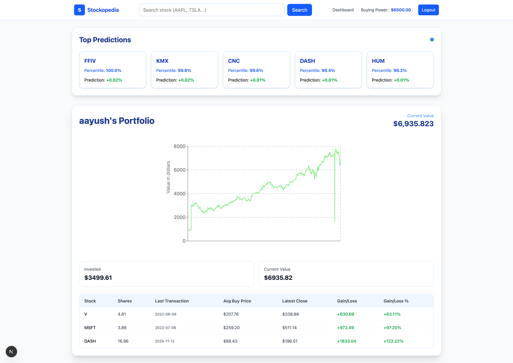
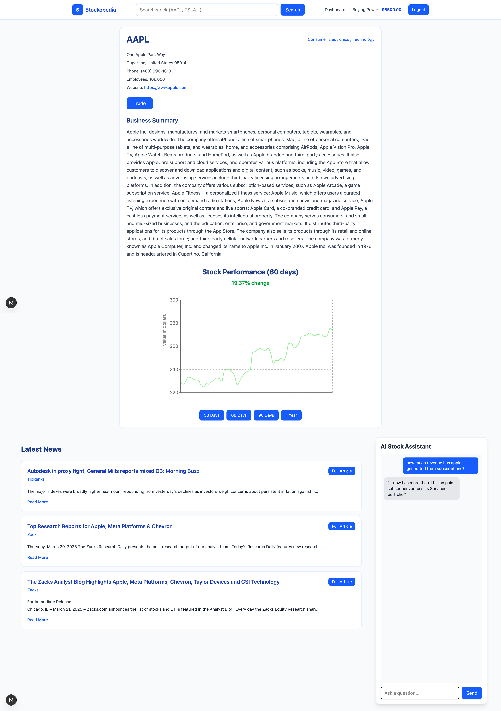

# Stockopedia

A modern stock trading and prediction platform with AI-powered insights and portfolio management. Perfect to learn how to trade and research stocks with the ability to paper trade and see results!

## Features

### Portfolio Management

- Real-time portfolio tracking and visualization (limited to yfinance data updates)
- Interactive charts with multiple timeframes
- Gain/loss calculations and performance metrics

### AI-Powered Predictions

- Top 5 stock predictions using machine learning
- AI stock assistant for research and analysis of stock news

### Trading & Analysis

- Buy/sell stocks
- Historical portfolio tracking and analysis
- Company fundamentals and news integration

### User Experience

- Clean, modern interface
- Responsive design for all devices
- Fast, intuitive navigation

## Tech Stack

### Frontend

- **Next.js **
- **TypeScript**
- **Tailwind CSS**
- **Recharts** - Data visualization

### Backend

- **FastAPI**
- **SQLAlchemy**
- **PostgreSQL**
- **Pandas**
- **LangChain**

### AI/ML

- **Ollama** - Local LLM inference
- **Custom prediction models** - Stock forecasting
- **RAG system** - AI assistant

## Screenshots

### Dashboard

### Stock Information and AI insights

_Chat with AI about stocks and market insights_
